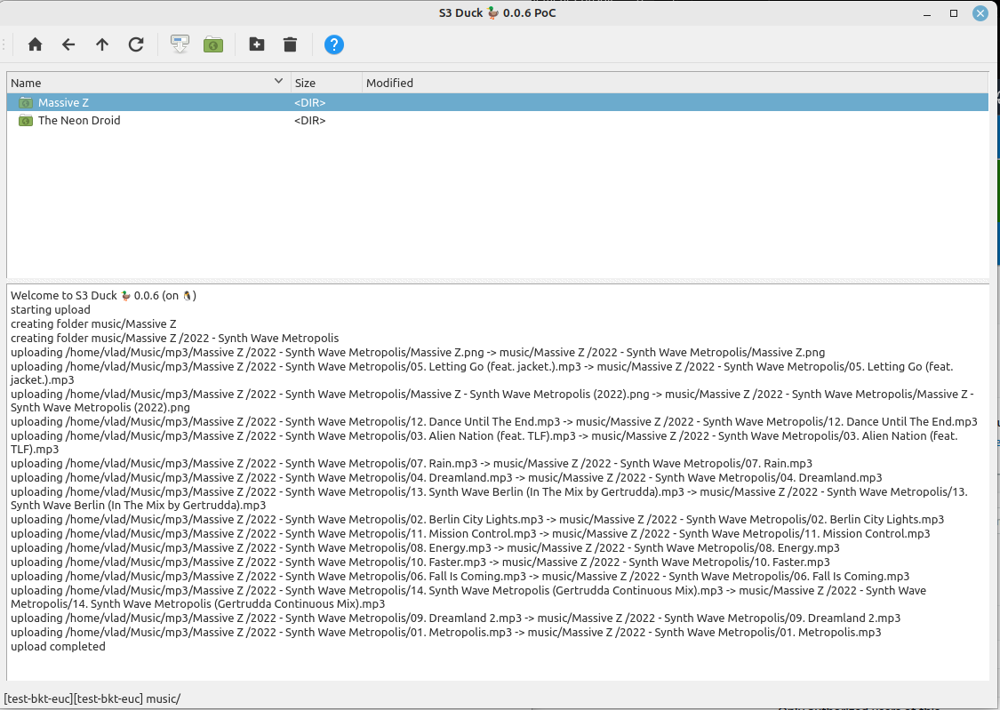

S3Duck 🦆
======

Simple cross-platform client for Simple Storage Service



How to launch
-------------

On Ubuntu/Mint: [use pre-built deb](https://github.com/nexusriot/s3duck/releases/latest)


Also, you can run the tool from the source code.
```
sudo apt install python3-boto3 python3-cryptography python3-pyqt5
```

```
python3 s3duck.py
```

We do recommend to prepare environment with virtualenv:
```
python3 -m virtualenv .venv
. .venv/bin/activate
pip3 install -r requirements.txt
```

```
python3 s3duck.py
```