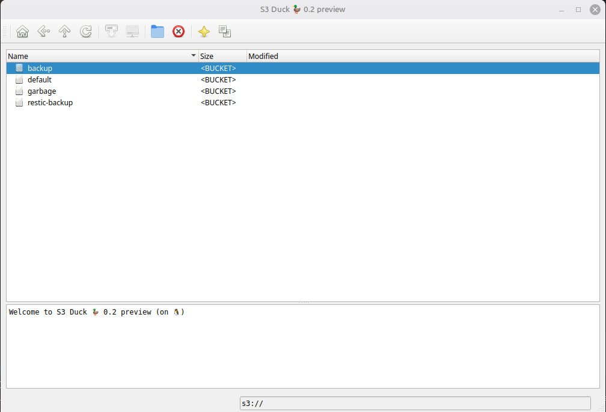
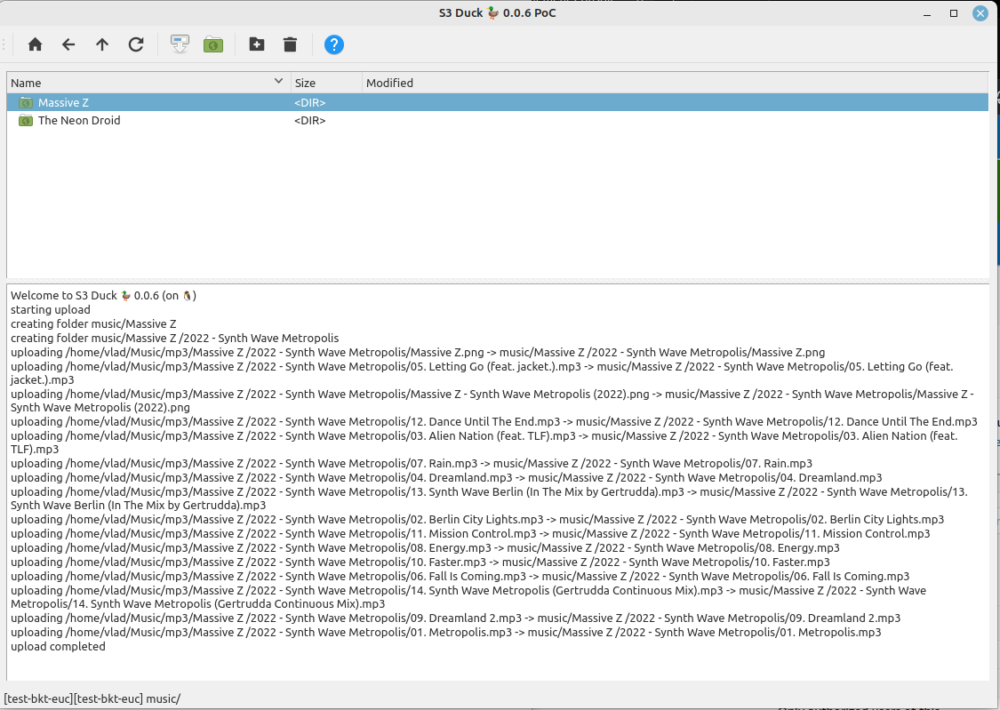

# S3Duck 🦆

Simple cross-platform GUI client for S3-compatible object storage (AWS S3, MinIO, Ceph, and others).




---

## Features

- **Multi-profile management** — create, edit, copy, and delete named connection profiles; credentials are encrypted at rest using Fernet symmetric encryption
- **Bucket browser** — list, create, and delete buckets; recursive delete with confirmation
- **Object browser** — navigate prefixes as a virtual folder tree with sorting by name, size, and modified date
- **Upload** — single/multiple files via dialog or drag-and-drop from the OS file manager
- **Download** — single files or entire folder prefixes, recreating the directory tree locally
- **Delete** — objects and folder prefixes (recursive)
- **Create folder** — creates an S3 prefix placeholder
- **Object properties** — key, size, ETag, and public URL
- **Presigned URL** — copy a temporary share link (1 hour expiry)
- **Make public** — set `public-read` ACL and copy direct URL
- **Bucket usage stats** — total size, breakdown by file category (Documents / Media / Other) with a pie chart, and top folder groups
- **Runtime profile switch** — switch S3 accounts without restarting the app
- **Automatic region/endpoint detection** — when an operation fails due to a region or endpoint mismatch the app probes the server for the correct region, rebuilds the client, and retries transparently; applies to bucket open, listing, upload, download, and delete
- **S3-compatible storage** — path-style addressing option for MinIO and similar backends
- **Cross-platform** — Linux, macOS, Windows

---

## Requirements

| Dependency    | Version  | Purpose                          |
|---------------|----------|----------------------------------|
| Python        | ≥ 3.10   | Runtime                          |
| PyQt6         | ≥ 6.7    | GUI framework                    |
| boto3         | ≥ 1.42   | AWS / S3-compatible SDK          |
| cryptography  | ≥ 46.0   | Fernet credential encryption     |
| pyinstaller   | ≥ 6.18   | Binary packaging (optional)      |

---

## Running from Source

**Quick start (system packages, Debian/Ubuntu):**
```bash
sudo apt install python3-boto3 python3-cryptography python3-pyqt6
python3 s3duck.py
```

**Recommended — virtualenv:**
```bash
python3 -m venv .venv
source .venv/bin/activate
pip install -r requirements.txt
python3 s3duck.py
```

---

## Building

### Debian / Ubuntu package
```bash
sudo apt-get install git devscripts build-essential lintian upx-ucl
./build_deb.sh              # auto-detects amd64 / arm64
./build_deb.sh arm64        # explicit architecture
```
Output: `build/s3duck_<version>_<arch>.deb`

### Linux binary (PyInstaller)
```bash
./build_linux_bin.sh
```

### macOS binary + DMG
```bash
./build_macos_bin.sh                  # native arch
./build_macos_bin.sh universal2       # fat binary (x86_64 + arm64)
./build_dmg.sh
```

### Windows binary
```bat
build_win.cmd
```

Pre-built releases are available on the [GitHub releases page](https://github.com/nexusriot/s3duck/releases/latest).

---

## Project Architecture

```
s3duck/
├── s3duck.py            Entry point — QApplication bootstrap, Profiles dialog
├── main_window.py       Main window — file browser, toolbar, async workers
├── model.py             S3/data layer — all boto3 operations, region retry logic
├── settings.py          Profile create/edit dialog
├── properties_window.py Object properties dialog
├── profile_switcher.py  Runtime profile-switch dialog
├── utils.py             Shared helpers (str_to_bool)
│
├── icons/               24 px SVG icons for toolbar and context menus
├── resources/           App icon (ico/icns/png), screenshots, .desktop file
├── DEBIAN/              Debian package metadata (control, postinst, prerm)
│
├── requirements.txt     Python dependencies
├── s3duck.spec          PyInstaller build spec
├── build_deb.sh         Build .deb package
├── build_linux_bin.sh   Build Linux self-contained binary
├── build_macos_bin.sh   Build macOS self-contained binary
├── build_dmg.sh         Pack macOS binary into .dmg
└── build_win.cmd        Build Windows self-contained binary
```

### Layers

```
┌─────────────────────────────────────────────────────────────────┐
│  Entry / Profile layer   s3duck.py                              │
│  Profiles dialog, Crypto (Fernet), SettingsItem                 │
├─────────────────────────────────────────────────────────────────┤
│  UI layer                main_window.py                         │
│  MainWindow, Tree, UpTopProxyModel, PieWidget,                  │
│  BucketUsageDialog, ListItem                                     │
├─────────────────────────────────────────────────────────────────┤
│  Worker / Threading layer   main_window.py                      │
│  NavigationWorker  BucketEnterWorker  Worker  UsageWorker       │
│  (each runs in a QThread, communicates via pyqtSignal)          │
├─────────────────────────────────────────────────────────────────┤
│  Dialog layer                                                   │
│  SettingsWindow  PropertiesWindow  ProfileSwitchWindow          │
├─────────────────────────────────────────────────────────────────┤
│  Data / S3 layer         model.py                               │
│  Model — boto3 wrapper, adaptive region/endpoint probing        │
└─────────────────────────────────────────────────────────────────┘
```

### Key components

| Component | File | Responsibility |
|---|---|---|
| `Profiles` | s3duck.py | CRUD for connection profiles; launches MainWindow |
| `Crypto` | s3duck.py | Fernet encrypt/decrypt of stored credentials |
| `MainWindow` | main_window.py | Root window — toolbar, splitter (tree + log), statusbar |
| `Tree` | main_window.py | Drag-and-drop `QTreeView`; hands drops to upload worker |
| `UpTopProxyModel` | main_window.py | Proxy that pins `[..]` to top and sorts BUCKET < FOLDER < FILE |
| `NavigationWorker` | main_window.py | Off-thread bucket/prefix listing; uses a private `Model` clone to avoid client races |
| `BucketEnterWorker` | main_window.py | Off-thread bucket entry with hints-based region/endpoint retry |
| `Worker` | main_window.py | Off-thread upload / download / delete with byte-level progress and cancellation |
| `UsageWorker` | main_window.py | Off-thread bucket size aggregation by file category |
| `PieWidget` | main_window.py | Custom `QPainter` pie chart for usage breakdown |
| `Model` | model.py | All boto3 calls; `_try_bind_bucket` probes addressing styles; `rebind_bucket` auto-corrects region mid-session |
| `SettingsWindow` | settings.py | Profile form (name, URL, region, bucket, keys, flags) |
| `PropertiesWindow` | properties_window.py | Object metadata: key, size, ETag, public URL |
| `ProfileSwitchWindow` | profile_switcher.py | Runtime profile switch without app restart |

### Data flow

```
User action
  │
  ▼
MainWindow  ──spawn──►  QThread + Worker/NavigationWorker
                              │   (private Model clone or shared Model)
                              │
                              ▼
                         Model.method()
                              │  boto3 S3 API call
                              ▼
                         AWS S3 / MinIO / Ceph …
                              │
                         pyqtSignal (progress / finished / error)
                              │
                              ▼
                         MainWindow  ──update──►  UI (tree, log, progress bar)
```

### Region / endpoint auto-retry flow

```
Operation fails  (AuthorizationHeaderMalformed | PermanentRedirect)
  │
  ▼
get_bucket_hints()          HEAD Bucket → x-amz-bucket-region header
  │
  ▼
build_region_swapped_endpoint()   rewrite AWS endpoint for new region
  │
  ▼
rebind_bucket()             swap endpoint + region → enter_bucket() → validate
  │
  ▼
retry original operation    transparent to the caller
```

### Credential storage

```
New profile
  │  access_key, secret_key
  ▼
Crypto.encrypt()  (Fernet, key stored in QSettings "common/key")
  │  encrypted bytes
  ▼
QSettings  →  ~/.config/s3duck/s3duck.ini

Launch profile
  │  encrypted bytes from QSettings
  ▼
Crypto.decrypt()  →  plaintext creds  →  boto3.Session
```

---

## License

See [LICENSE](LICENSE).

## Author

[Vladislav Ananev](https://github.com/nexusriot) © 2022–2026
