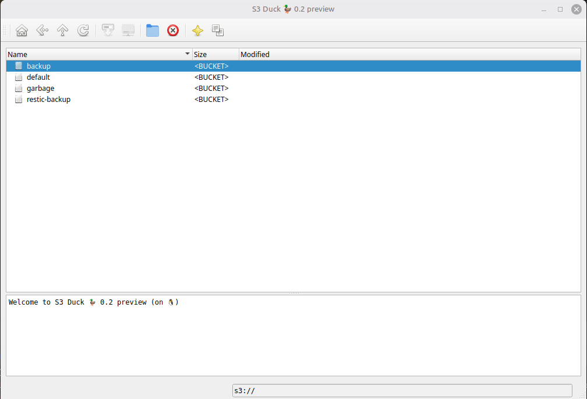
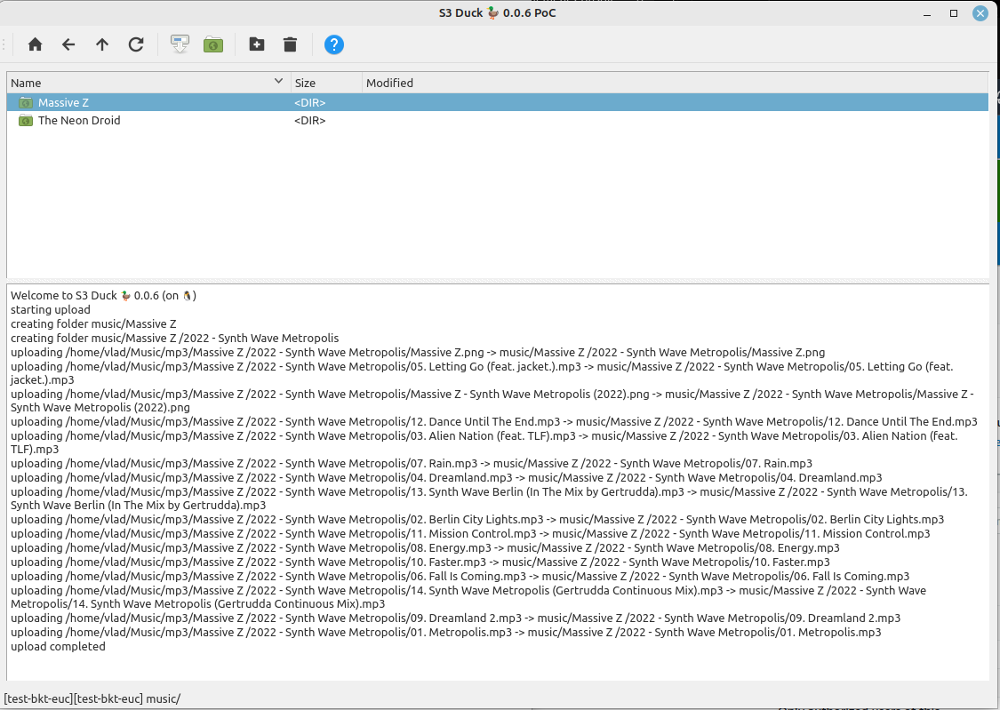

# S3Duck 🦆

Simple cross-platform GUI client for S3-compatible object storage (AWS S3, MinIO, Ceph, and others).




---

## Features

- **Multi-profile management** — create, edit, copy, and delete named connection profiles; credentials are encrypted at rest using Fernet symmetric encryption
- **Temporary credentials** — session-token support for STS / SSO / assumed-role / MFA keys, with one-click import of any profile from `~/.aws/credentials`
- **Bucket browser** — list, create, and delete buckets; recursive delete runs through the transfer queue (progress + cancel, UI stays responsive)
- **Empty bucket** — delete every object, version, delete marker and in-flight upload while keeping the bucket, queued with progress and cancel
- **Incomplete uploads** — find and abort in-flight multipart uploads that are invisible to normal listings but keep their parts billed; shows how much space they waste and can abort everything older than N days
- **Object browser** — navigate prefixes as a virtual folder tree with sorting by name, size, and modified date
- **Upload** — single/multiple files via dialog or drag-and-drop from the OS file manager; whole directory trees via "Upload folder" (`Ctrl+Shift+U`) or drag-and-drop
- **Download** — single files or entire folder prefixes, recreating the directory tree locally
- **Transfer settings** — multipart connections per transfer plus the storage class and server-side encryption (SSE-S3 / SSE-KMS) applied to uploads, persisted across sessions
- **Overwrite protection** — downloads, copies, moves and renames detect existing destinations and offer Skip / Overwrite / Cancel
- **Sync with a local folder** (`Ctrl+E`) — compare a directory against a prefix in either direction, review a dry-run plan (upload / download / delete / skip with a reason per file), then run it through the queue; optionally delete extras at the destination
- **Transfer queue** — queued jobs with per-row progress, cancel, and retry for failed or cancelled entries
- **Completion notifications** — a desktop notification when the queue drains while the window is in the background (toggle in Transfer settings)
- **Delete** — objects and folder prefixes (recursive, batched 1000 keys per call); confirmation shows the scanned object count and total size; recursive bucket delete also purges noncurrent versions, delete markers and in-flight uploads
- **Copy / Move** — server-side copy or move of a multi-selection, within a bucket or **across buckets** (same endpoint/region)
- **Rename** — in-place rename of a file or folder (server-side copy + delete), on the context menu or `F2`
- **Bulk rename** (`Shift+F2`) — rename a whole selection by find-and-replace (optionally regex, with backreferences) or a `{name}/{ext}/{n}` numbering template, with a live preview and duplicate/invalid-name checks
- **Create folder** — creates an S3 prefix placeholder
- **Preview / open** — double-click a file to preview images and text in-app, or open any object with the OS default application
- **Recursive search** — search a whole bucket/prefix by key substring or regular expression (`Ctrl+Shift+F` or "Search here…"), filtered by size range, extension and modified date, with jump-to-location on any result
- **Object versioning** — enable/suspend bucket versioning from the UI; list every version and delete marker of an object, download a specific version, promote an older version to current, or delete individual versions
- **Storage class** — view an object's storage class and change it (Standard, IA, Intelligent-Tiering, Glacier, Deep Archive, …); works on a multi-selection or whole folders and runs through the transfer queue
- **Glacier restore** — initiate a restore of archived objects (single, multi-select, or whole prefixes) with a chosen retrieval tier and retention window, queued like other transfers; restore status shown in properties
- **Edit metadata** — set `Content-Type`, `Cache-Control`, `Content-Disposition`, `Content-Encoding`, and custom `x-amz-meta-*` user metadata
- **Object properties** — key, size, ETag, storage class, restore status, and public URL
- **Presigned links** — generate a temporary download (GET) or **upload (PUT)** link with a configurable expiry (up to the 7-day S3 maximum)
- **Make public** — set `public-read` ACL and copy direct URL; when the ACL is refused, Block Public Access and Object Ownership settings are reported as the reason
- **Clickable breadcrumb** — jump straight to any parent prefix, the bucket root, or the bucket list from the path bar
- **Go to location** (`Ctrl+L`) — paste an `s3://bucket/prefix` (or a bare prefix) and jump straight there, across buckets
- **Remembered layout** — splitter position, column widths and sort order persist between sessions
- **Listing summary** — folder/file counts and total size of the current listing in the status bar
- **Theme** — Light, Dark, or system-default appearance, remembered across sessions
- **Bucket usage stats** — total size, breakdown by file category (Documents / Media / Other) with a pie chart, and top folder groups
- **Runtime profile switch** — switch S3 accounts without restarting the app
- **Cached bucket bindings** — the proven endpoint/region/addressing combination per bucket is remembered, so reopening an off-region bucket skips the probe round trips
- **Automatic region/endpoint detection** — when an operation fails due to a region or endpoint mismatch the app probes the server for the correct region, rebuilds the client, and retries transparently; applies to bucket open, listing, upload, download, and delete
- **S3-compatible storage** — path-style addressing option for MinIO and similar backends
- **Cross-platform** — Linux, macOS, Windows

---

## Requirements

| Dependency    | Version  | Purpose                          |
|---------------|----------|----------------------------------|
| Python        | ≥ 3.10   | Runtime                          |
| PyQt6         | ≥ 6.7    | GUI framework                    |
| boto3         | ≥ 1.42   | AWS / S3-compatible SDK          |
| cryptography  | ≥ 46.0   | Fernet credential encryption     |
| pyinstaller   | ≥ 6.18   | Binary packaging (optional)      |

---

## Running from Source

**Quick start (system packages, Debian/Ubuntu):**
```bash
sudo apt install python3-boto3 python3-cryptography python3-pyqt6
python3 s3duck.py
```

**Recommended — virtualenv:**
```bash
python3 -m venv .venv
source .venv/bin/activate
pip install -r requirements.txt
python3 s3duck.py
```

---

## Building

### Debian / Ubuntu package
```bash
sudo apt-get install git devscripts build-essential lintian upx-ucl
./build_deb.sh              # auto-detects amd64 / arm64
./build_deb.sh arm64        # explicit architecture
```
Output: `build/s3duck_<version>_<arch>.deb`

### Linux binary (PyInstaller)
```bash
./build_linux_bin.sh
```

### macOS binary + DMG
```bash
./build_macos_bin.sh                  # native arch
./build_macos_bin.sh universal2       # fat binary (x86_64 + arm64)
./build_dmg.sh
```

### Windows binary
```bat
build_win.cmd
```

Pre-built releases are available on the [GitHub releases page](https://github.com/nexusriot/s3duck/releases/latest).

---

## Project Architecture

```
s3duck/
├── s3duck.py            Entry point — QApplication bootstrap, Profiles dialog
├── main_window.py       Main window — file browser, toolbar, async workers
├── model.py             S3/data layer — all boto3 operations, region retry logic
├── settings.py          Profile create/edit dialog
├── properties_window.py Object properties dialog
├── profile_switcher.py  Runtime profile-switch dialog
├── theme.py             Light / Dark / system palette switching
├── utils.py             Shared helpers (str_to_bool, center_on_screen, ~/.aws parsing, local tree scan)
│
├── icons/               24 px SVG icons for toolbar and context menus
├── resources/           App icon (ico/icns/png), screenshots, .desktop file
├── DEBIAN/              Debian package metadata (control, postinst, prerm)
│
├── requirements.txt     Python dependencies
├── s3duck.spec          PyInstaller build spec
├── build_deb.sh         Build .deb package
├── build_linux_bin.sh   Build Linux self-contained binary
├── build_macos_bin.sh   Build macOS self-contained binary
├── build_dmg.sh         Pack macOS binary into .dmg
└── build_win.cmd        Build Windows self-contained binary
```

### Layers

```
┌─────────────────────────────────────────────────────────────────┐
│  Entry / Profile layer   s3duck.py                              │
│  Profiles dialog, Crypto (Fernet), SettingsItem                 │
├─────────────────────────────────────────────────────────────────┤
│  UI layer                main_window.py                         │
│  MainWindow, Tree, UpTopProxyModel, PieWidget,                  │
│  BucketUsageDialog, ListItem                                     │
├─────────────────────────────────────────────────────────────────┤
│  Worker / Threading layer   main_window.py                      │
│  NavigationWorker  BucketEnterWorker  Worker  UsageWorker       │
│  (each runs in a QThread, communicates via pyqtSignal)          │
├─────────────────────────────────────────────────────────────────┤
│  Dialog layer                                                   │
│  SettingsWindow  PropertiesWindow  ProfileSwitchWindow          │
├─────────────────────────────────────────────────────────────────┤
│  Data / S3 layer         model.py                               │
│  Model — boto3 wrapper, adaptive region/endpoint probing        │
└─────────────────────────────────────────────────────────────────┘
```

### Key components

| Component | File | Responsibility |
|---|---|---|
| `Profiles` | s3duck.py | CRUD for connection profiles; launches MainWindow |
| `Crypto` | s3duck.py | Fernet encrypt/decrypt of stored credentials |
| `MainWindow` | main_window.py | Root window — toolbar, splitter (tree + log), statusbar |
| `Tree` | main_window.py | Drag-and-drop `QTreeView`; hands drops to upload worker |
| `UpTopProxyModel` | main_window.py | Proxy that pins `[..]` to top and sorts BUCKET < FOLDER < FILE |
| `NavigationWorker` | main_window.py | Off-thread bucket/prefix listing; uses a private `Model` clone to avoid client races |
| `BucketEnterWorker` | main_window.py | Off-thread bucket entry with hints-based region/endpoint retry |
| `Worker` | main_window.py | Off-thread upload / download / delete with byte-level progress and cancellation |
| `UsageWorker` | main_window.py | Off-thread bucket size aggregation by file category |
| `PieWidget` | main_window.py | Custom `QPainter` pie chart for usage breakdown |
| `Model` | model.py | All boto3 calls; `_try_bind_bucket` probes addressing styles; `rebind_bucket` auto-corrects region mid-session |
| `PreviewDialog` | main_window.py | In-app image/text preview; "open with default app" via a temp download |
| `VersionsDialog` | main_window.py | Per-object version manager (list / download / make-current / delete); lists off-thread |
| `IncompleteUploadsDialog` | main_window.py | Find and abort orphaned multipart uploads still holding billed parts |
| `TransferSettingsDialog` | main_window.py | Concurrency plus upload storage class / encryption |
| `OverwriteDialog` | main_window.py | Skip / Overwrite prompt for existing destinations |
| `BulkRenameDialog` | main_window.py | Find-replace / template rename with live preview |
| `SyncDialog` | main_window.py | Local↔remote comparison, dry-run plan, queued execution |
| `MetadataDialog` | main_window.py | Edit Content-Type / caching headers and custom user metadata |
| `SearchDialog` | main_window.py | Recursive key search over a bucket/prefix with jump-to-location |
| `PresignedLinkDialog` | main_window.py | Generate GET/PUT presigned links with a configurable expiry |
| `Breadcrumb` | main_window.py | Clickable path bar for jumping to parent prefixes |
| `apply_theme` | theme.py | Light / Dark / system palette switching |
| `SettingsWindow` | settings.py | Profile form (name, URL, region, bucket, keys, flags) |
| `PropertiesWindow` | properties_window.py | Object metadata: key, size, ETag, storage class, restore status, public URL |
| `ProfileSwitchWindow` | profile_switcher.py | Runtime profile switch without app restart |

### Data flow

```
User action
  │
  ▼
MainWindow  ──spawn──►  QThread + Worker/NavigationWorker
                              │   (private Model clone or shared Model)
                              │
                              ▼
                         Model.method()
                              │  boto3 S3 API call
                              ▼
                         AWS S3 / MinIO / Ceph …
                              │
                         pyqtSignal (progress / finished / error)
                              │
                              ▼
                         MainWindow  ──update──►  UI (tree, log, progress bar)
```

### Region / endpoint auto-retry flow

```
Operation fails  (AuthorizationHeaderMalformed | PermanentRedirect)
  │
  ▼
get_bucket_hints()          HEAD Bucket → x-amz-bucket-region header
  │
  ▼
build_region_swapped_endpoint()   rewrite AWS endpoint for new region
  │
  ▼
rebind_bucket()             swap endpoint + region → enter_bucket() → validate
  │
  ▼
retry original operation    transparent to the caller
```

### Credential storage

```
New profile
  │  access_key, secret_key
  ▼
Crypto.encrypt()  (Fernet, key stored in QSettings "common/key")
  │  encrypted bytes
  ▼
QSettings  →  ~/.config/s3duck/s3duck.ini

Launch profile
  │  encrypted bytes from QSettings
  ▼
Crypto.decrypt()  →  plaintext creds  →  boto3.Session
```

---

## License

See [LICENSE](LICENSE).

## Author

[Vladislav Ananev](https://github.com/nexusriot) © 2022–2026
